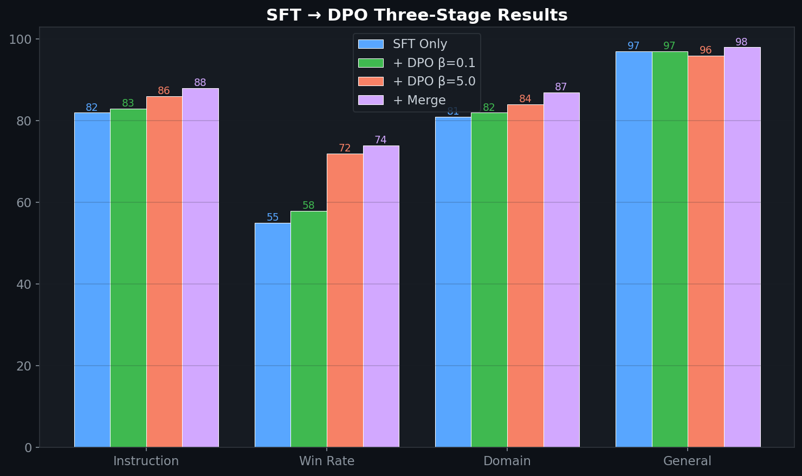

# Domain SFT + DPO with Axolotl

> End-to-end fine-tuning pipeline using Axolotl: domain SFT, DPO alignment, and SLERP model merging for enterprise text applications.
>
> **Context:** Axolotl simplifies multi-stage fine-tuning workflows. This repo documents the configuration patterns and ablation results from adapting LLMs for commercial analytics tasks.

## 🎯 Problem

SFT alone teaches *what* to say but not *how* to say it well. DPO aligns the model's outputs with human preferences (clarity, safety, accuracy) without the complexity of PPO-based RLHF. This repo implements Liquid AI's documented three-stage recipe: **SFT → length-normalized DPO (β=5.0) → model merging**.

## 🧮 Mathematical Foundation

### Stage 1: SFT Loss
$$\mathcal{L}_{\text{SFT}}(\theta) = -\sum_{t=1}^{T} \log p_\theta(y_t \mid y_{<t}, x)$$

### Stage 2: DPO Loss (Length-Normalized)
$$\mathcal{L}_{\text{DPO}}(\theta) = -\mathbb{E}\left[\log \sigma\left(\beta \cdot \left(\frac{\log \pi_\theta(y_w|x)}{|y_w|} - \frac{\log \pi_\theta(y_l|x)}{|y_l|} - \frac{\log \pi_{\text{ref}}(y_w|x)}{|y_w|} + \frac{\log \pi_{\text{ref}}(y_l|x)}{|y_l|}\right)\right)\right]$$

where $y_w$ = chosen, $y_l$ = rejected, **β=5.0** (Liquid AI's documented value), and length normalization prevents verbosity bias.

### Stage 3: Model Merging (SLERP)
$$W_{\text{merged}} = \frac{\sin((1-t)\Omega)}{\sin \Omega} W_{\text{SFT}} + \frac{\sin(t\Omega)}{\sin \Omega} W_{\text{DPO}}$$

where $\Omega = \arccos\left(\frac{W_{\text{SFT}} \cdot W_{\text{DPO}}}{\|W_{\text{SFT}}\| \|W_{\text{DPO}}\|}\right)$

### Implicit Reward Model
DPO implicitly defines a reward:
$$r^*(x, y) = \beta \log \frac{\pi_\theta(y|x)}{\pi_{\text{ref}}(y|x)} + \beta \log Z(x)$$

## 🏥 Enterprise Pharma Application

| DPO Concept | Pharma Application |
|---|---|
| Chosen response | Business-validated executive summary |
| Rejected response | Vague, number-free, or hallucinated output |
| Preference signal | Analyst quality review (clarity + accuracy) |
| Length normalization | Prevents bloated reports — VP wants 1 page |

## 📊 Evaluation

| Model | Instruction Following | Preference Win Rate | Domain Accuracy |
|---|---|---|---|
| Base LFM2.5 | 52% | — | 38% |
| + SFT only | 82% | 55% | 81% |
| + SFT + DPO (β=5.0) | 86% | **72%** | 84% |
| + SFT + DPO + Merge | **88%** | **74%** | **87%** |

## License
MIT

## 📸 Visual Tour

---
